# Java入门

## 基本知识

#### JRE、JDK、JVM的关系

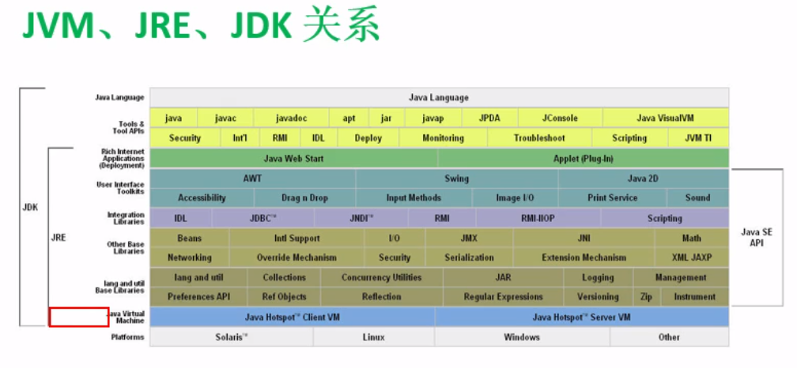

**关键字**：public, class interface, true, null... **保留字**(可能以后会被作为关键字)：goto, cast, inner... **标识符**，java对各种变量、方法和类等要素命名时使用的字符序列(自己取名)：Test1, Solution... 

#### 数据类型

8种基本数据类型:byte, short , int ,long, float, double, char, boolean

引用数据类型:String, class, interface, (数组)[ ] ...

```java
/**
*内存中只会存在一个"hello"
*s0 s1都是对同一个内存地址的引用
*/
String s0 = "hello";
String s1 = "hello";
/*char类型的数据可以转换为对应的ASCII码值进行计算*/
char c = 'a';
System.out.println(c+1);//98
/*boolean类型不可转换为其他数据类型*/
```

#### 运算符(算数 赋值 比较 逻辑 位 三元运算符)

```Java
/*赋值可用逗号，隔开*/
int i = 100, i1, i2 =1;
/**逻辑异或^
*单&时，左右两边都计算; 双&&左为假则右不运算；||同理
*/

/**位运算符
*补码=反码+1
*15的二进制:   00000000 00000000 00000000 00001111
*负15的二进制:11111111 11111111 11111111 11110001
*左移<<, 2^n, 例如3<<2 = 12
*右移>>, 2^-n, 例如3>>1 = 1
*无符号右移>>>, 负数右移后会补0，-8>>>2 = 1073741822 = (00111111 11111111 11111111 11111110)二进制
*与运算&，或运算|，异或运算^，反码~，例如~10=-11
*/

//只有单目、三元、赋值运算符是从右向左运算的

```

#### <u>堆、栈、方法区、静态域</u> 

待进一步学习。栈中存储的是基础数据类型和对象的引用(地址)，堆存储的是对象，方法区保存class和static变量。

## 面向对象

面向对象程序设计的重点是**类的设计**。对象是类的实例化。类由属性和方法组成。

同一个类中，所有的方法可以相互调用不需要实例化。但类中main函数调用方法需要实例化。

```java
/*方法的可变参数*/
public void printInfo (int... args){
    for(int i:args){
        System.out.println(i);
    }
}
my.printInfo(new int[]{1,1,2});//这三种调用都是可行的
my.printInfo(1,1,2);
my.printInfo();
```

#### 访问权限修饰符


#### 关键字this

```java
this();//可用于调用构造器，不能出现构造器反复调用
```

#### JavaBean

JavaBean 是一种JAVA语言写成的可重用组件。类必须是具体的和公共的，并且具有无参数的构造器。JavaBean 通过提供符合一致性设计模式的公共方法将内部域暴露成员属性，set和get方法获取。众所周知，属性名称符合这种模式，其他Java 类可以通过自省机制(反射机制)发现和操作这些JavaBean 的属性。**IDEA快速生成javaBean: 选中类中的属性 -> alt+insert -> Getter and Setter**

#### 继承

```java
//关键词：extends
//一个子类不可有多个父类
class Student extends Person{
    
}
```

##### **@override**

方法重写(重置/覆盖)要求：
重写方法必须和被重写方法具有相同的名称、参数列表、返回值类型。
重写方法不能使用比被重写方法更严格的访问权限。
同时为static或同时为非static。
子类方法抛出的异常不能大于父类被重写方法的异常。
重写Override与重载Overload的区别。[超链接](https://www.runoob.com/java/java-override-overload.html)

##### **关键字super**

在Java类中使用super来调用父类中指定的操作：
super可用于访问父类中定义的属性
super可用于调用父类中定义的成员方法
super可用于在子类构造方法中调用父类的构造器

```java
//子类重写父类中的一个方法
@Override
    public int size() {
        return super.size();
    }
/**Tips:当子父类出现同名成员时，可用super进行区分
*super的追朔不仅限于直接父类
*super和this的用法相似，this代表本类对象的引用，super代表父类的内存空间的标识*/

//当父类中没有空参构造器时，子类的构造器必须通过this或者super调用父类中的构造器，且必须放在构造器的第一行
public Kids(int age,int salary){
    super(sex,salary);
}
```

#### 实例化过程

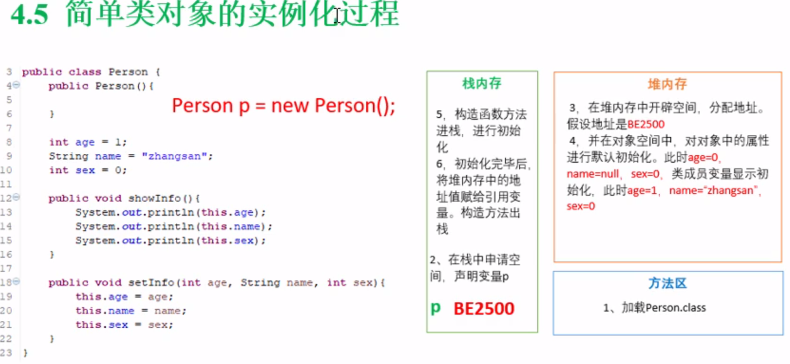

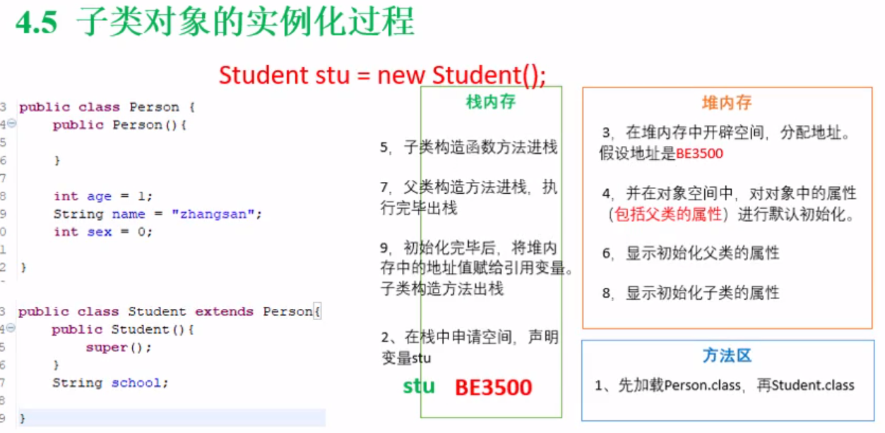

#### 多态

Java引用变量有两个类型：**编译时类型**和**运行时类型**。编译时类型由声明该变量时使用的类型决定，运行时类型由实际赋给该变量的对象决定。

```java
//(向上转型upcasting)父类的引用对象可以指向子类的实例
Person e = new Student();
//该变量无法访问子类中添加的属性和方法
e.getSchool();//wrong
//虚拟方法调用。动态绑定。可以访问子类中重写的方法。
e.showAge();//调用Student类中的showAge()方法
```

##### instanceof操作符

```java
boolean result = obj instanceof Class
//测试一个对象是否为一个类的实例
Person e = new Student();
System.out.println(e instanceof Student); //true
Student s = new Student();
System.out.println(s instanceof Person); //true
```

#### 对象类型转换Casting

```java
//父类到子类必须强制类型转换
Person p = new Person();
Student s = (Student) p; 
//子类到父类可以自动进行
Student s = new Student();
Person p = s;
//常搭配instanceof使用
if(obj instanceof Order)
    Order o = (Order) obj;
```

#### equals与==

```java
/*当对类File、String、Date及包装类(Wrapper Class)来说，应该用equals比较内容*/
String s1 = new String("aaa");
String s2 = new String("aaa");
s1 == s2; //false
s1.equals(s2); //true
/*少用new String方式创建(节省内存，见下图)*/
String s1 = "aaa";
String s2 = "aaa";
s1 == s2; //true
```

##### String对象的创建

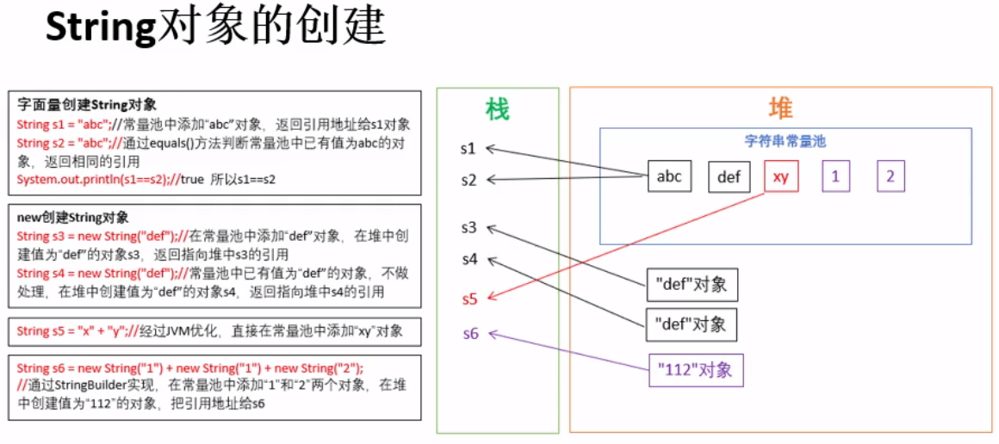

#### 包装类(封装类)

八种Boolean、Byte、Short、Integer、Long、Character、Float、Double

```java
//包装类支持自动装箱和拆箱
Integer i = 112;//Integer i = new Integer(111);
int i0 = i;//int i0 = i.intValue();
//常用 基本数据类型转字符串
int i = Integer.parseInt("123");
String str = String.valueOf(123)；
```

#### Singleton单例设计模式

```java
/*当类只能存在一个对象实例时：*/
/*饿汉式单例*/
//类加载，无人调用时就new对象
public class Single{
    private Single(){}//构造方法私有化
    private static Single single = new Single();
    public static Single getSingle(){
        return single;
    }
}
/*懒汉式单例*/
//第一次调用getSingle方法时new对象
public class Single{
    private Single(){}//构造方法私有化
    private static Single single = null;
    public static Single getSingle(){
        if(single == null)
            single = new Single();
        return single;
    }
}
```

#### 关键字final

```java
//final标记的类不能被继承。
//final标记的方法不能被子类重写。
//final标记的变量称为常量。名称大写，只能被赋值一次
final double PI = 3.14;
```
#### 接口interface

接口是一系列**动作**的抽象。
接口interface是抽象方法和常量值的定义和集合。
java不支持多重继承，接口实现了多重继承的效果。
本质上，接口是特殊的抽象类，只包含常量和方法的定义，没有变量和方法的实现。

```java
/**接口的特点:
*用interface定义
*成员变量默认 public static final修饰
*方法默认public abstract修饰
*没有构造器
*采用多层继承机制
*子类用implements继承接口
*/
public interface Runner{
    int ID = 1;           //public static final int ID = 1;
    void start();         //public abstract void start();
    void run();          //public abstract void run();
    void stop();         //public abstract void stop();
}
```
接口应用举例

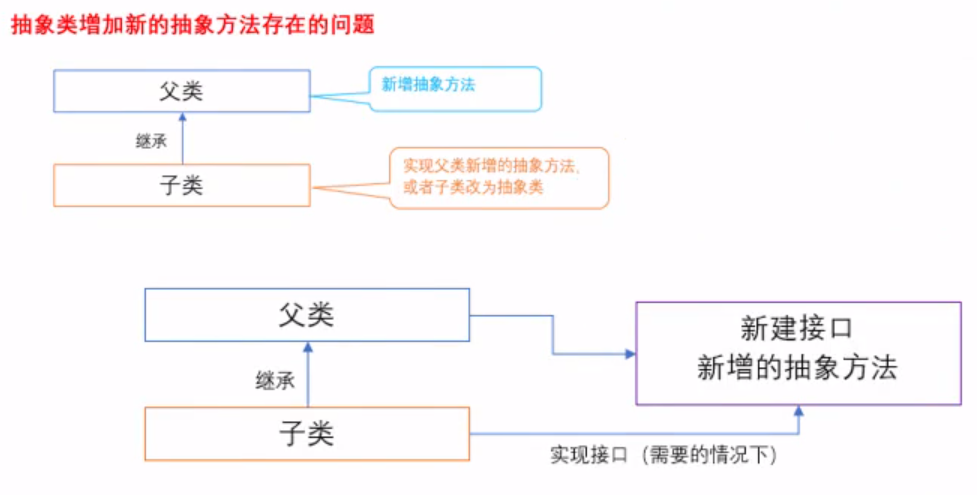

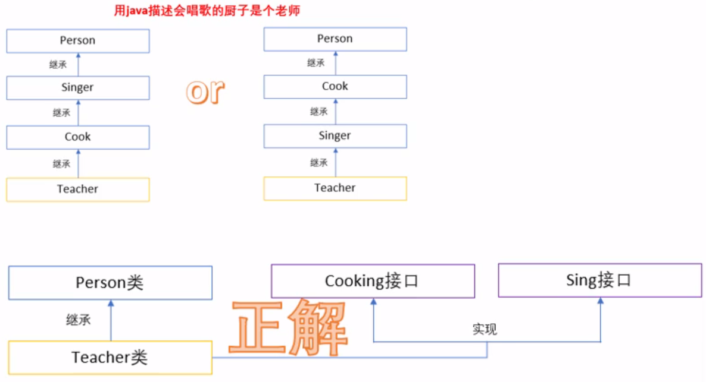

#### FactoryMethod工厂模式

定义一个创建产品对象的工厂接口，将产品对象的实际创建工作推迟到具体子工厂类当中。这满足创建型模式中所要求的“创建与使用相分离”的特点。
[**工厂方法模式（详解版）**](http://c.biancheng.net/view/1348.html)

#### 内部类

1.每个内部类都能独立的继承一个接口的实现，所以无论外部类是否已经继承了某个(接口的)实现，对于内部类都没有影响。内部类使得多继承的解决方案变得完整。
2.方便将存在一定逻辑关系的类组织在一起，又可以对外界隐藏。
3.方便编写事件驱动程序。
4.方便编写线程代码。
[**Java 内部类详解**](https://www.runoob.com/w3cnote/java-inner-class-intro.html)

#### 总结

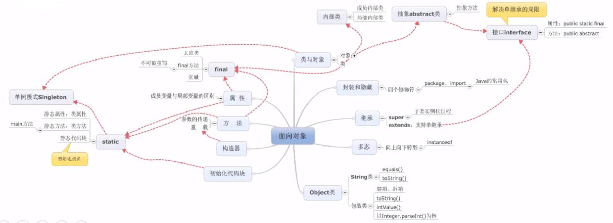

## 异常处理

在Java语言中，将程序执行中发生的不正常情况成为异常。异常事件可分为Error和Exception
Error：JVM系统内部错误、资源耗尽等情况
Exception：编程错误或偶然的外在因素导致的问题，空指针访问、网络连接中断等
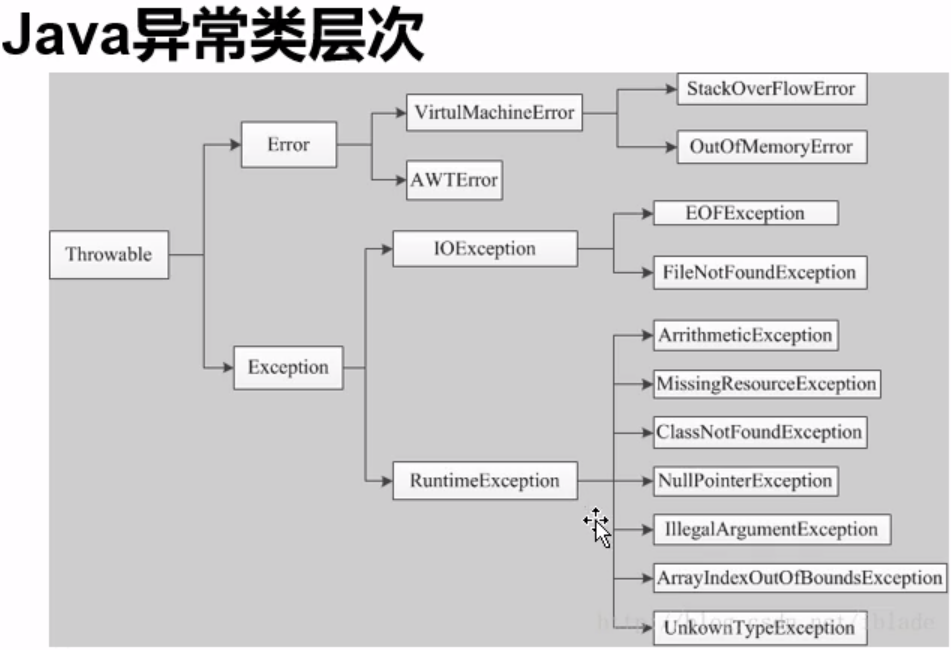
常见的异常：
RuntimeException错误的类型转换、数组下标越界、空指针访问等
IOExeption读取不存在文件、连接不存在的URL、越过文件结尾读取EOFException等


```java
        try{
            //可能异常的代码段
        }catch(Exception e){
            //捕获到异常后进行处理的代码段
            //Exception是所有异常的父类，见上图
            //可以接多个catch
            e.getMessage();//得到有关异常事件的信息
            e.printStackTrace();//异常事件发生时执行堆栈的内容
        }finally {
            //无论有没有捕获到异常，最终都会执行的代码段
        }
/*用throw抛出异常, 抛出的异常可用try-catch捕获*/
class A {
    int i = 1;
    public void aTest1() throws NullPointerException{
        A a = null;
        System.out.println(a.i);
    }
    public void aTest2(){
        A a = null;
        if(a==null) throw new NullPointerException("a不存在");
        System.out.println(a.i);
    }
}
```

## 集合(Set, List, Map)

Collection位于java.util中，是用来存放对象的容器。集合存放的是对象的引用，对象本身存放在堆内存中
Set无序不可重复；List有序可重复；Map映射关系

```java
/*HashSet，不能保证元素排列顺序，不可重复，不是线程安全的，元素可以为null
当HashSet集合中存入一个元素时，HashSet会调用该对象的hashCode()方法获得hashCode值，然后根据hashCode值决定该对象在集合中的存储位置*/
Set set = new HashSet();
//迭代器遍历集合
Iterator it = set.iterator();
while(it.hasNext()){
    System.out.println(it.next());
}
//for-each遍历集合
for(Object obj : set){
     System.out.println(obj);
}
/*TreeSet，可以确保集合元素处于排序状态。支持自然排序(元素数值从小到大排序)和定制排序。*/
//通过重写compare方法实现定制排序，效果：元素从大到小排序
TreeSet<Integer> set = new TreeSet<Integer>(new Comparator<Integer>() {
    @Override
    public int compare(Integer a, Integer b) {
        if(a>b)
            return -1;
        else if (a.equals(b))
            return 0;
        return 1;
    }
});
//通过Comparator接口实现类的排序
TreeSet<Person> set = new TreeSet<Person>(new Person());//这里new Person()是为了调用继承了Comparator的Person中的compare方法
class Person implements Comparator<Person>{
    private int age;
    private String name;
    @Override
    public int compare(Person a, Person b) {
        if(a.age>b.age)
            return 1;
        else if(a.age==b.age)
            return 0;
        return -1;
    }
}
```

```java
/*List*/
list.addAll(2, list0);//在list下标为2处插入list0集合的所有元素
list.lastIndexof("d");//获取字符串"d"在集合中最后一次出现的位置
list.subList(2, 4);//截取子集，下标index取2不取4
```

```java
/*Map: HashMap;TreeMap;Hashtable*/
map.keySet();//获取key集合，可用于遍历map
map.values();//获取value集合
//map.entrySet()集合遍历
import java.util.Map.Entry;
Set<Entry<String,Integer>> entrys = map.entrySet();
for(Entry<String,Integer> en : entrys){
    en.getKey();
    en.getValue();
}
```

#### 工具类Collections

```java
Collections.reverse(list);//反转
Collections.shuffle(list);//随机排序
Collections.sort(list, new Comparator<Integer>() {//也可以指定已经存在的Comparator
    @Override
    public int compare(Integer t0, Integer t1) {
        //通过重写compare函数进行排序
        return 0;
    }
});
Collections.swap(list,2,3);//交换第2个和第3个元素
Collections.max(list);//返回最大元素
Collections.frequency(list,56);//返回56在list中的出现次数
Collections.replaceAll(list,5,8);//将list中的5都替换为8
```

#### 泛型<>

**Java中得泛型，只在编译阶段有效。**在编译过程中，正确检验泛型结果后，会将泛型得相关信息擦除，并且在对象进入和离开方法得边界处添加类型检查和类型转换得方法。**泛型信息不会进入到运行时阶段。**

```java
/*1.泛型类*/
class A<T>{
    //此处T可以任取
    private T key;
    public void setKey(T key){
        this.key = key;
    }
    public T getKey(){
        return this.key;
    }
}
//使用
A<String> a1 = new A<>();
a1.setKey("xxxxx");
String s = a1.getKey();

/*2.泛型接口*/
//未传入泛型实参时，与泛型类的定义相同，在声明类的时候，需要将泛型的声明也一起加到类中
public class MyArrayList<AnyType> implements Iterable<AnyType>
{
  //...略
}
public interface Iterable<T> {
    Iterator<T> iterator();
    //Iterable.class ...略
}

/*3.泛型方法*/
class C{
    public <T> T test1(T s){
        return s;
    }
}

/*4.通配符*/
//不确定集合中的元素具体的数据类型，使用?表示所有类型
public void test(List<?> list){
  System.out.println(list);
}
//有限制的通配符：
//<? extends Person> 只允许Person及其子类引用调用
//<? super Person> 只允许Person及其父类引用调用
//<? extends Comparable> 只允许“实现Comparable接口的实现类”的引用调用
```


## 枚举

在某些情况下，一个类的对象时有限而且固定的。例如季节类，只能有4个对象
手动实现枚举类(类似于**Singleton单例模式**)：
  private修饰构造器
  属性使用private final修饰
  把该类的所有实例都是用public static final修饰
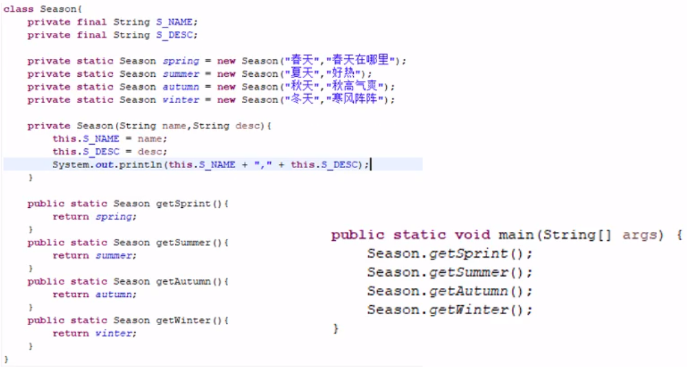
使用enum实现枚举

```java
enum Season{
    SPRING("春天", "春暖花开"),
    SUMMER("夏天", "炎炎夏日"),
    AUTUMN("秋天", "秋高气爽"),
    WINTER("冬天", "大雪纷飞");

    private final String sName;
    private final String sDesc;

    Season(String sName, String sDesc) {
        this.sName = sName;
        this.sDesc = sDesc;
    }
    
    public String getsName() {return sName;}
    public String getsDesc() {return sDesc;}
}
//调用
Season s = Season.SUMMER;
s.getsName();
s.getsDesc();
```

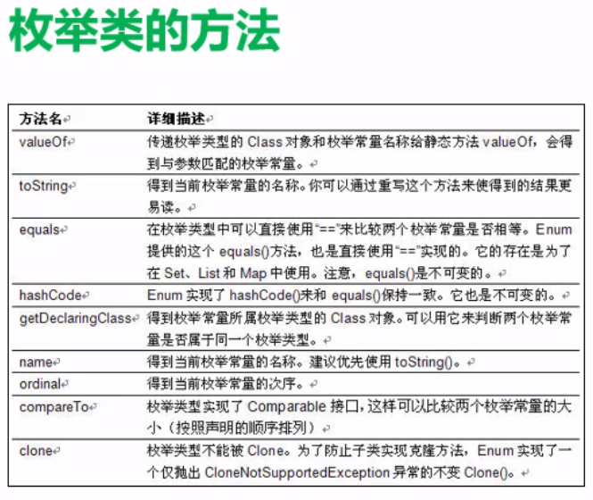

## 注解Annotation(了解)
Annotation是代码里的特殊标记，可以在编译、类加载、运行时被读取，并执行相应的处理。可以在**不改变原有逻辑**的情况下，在源文件中嵌入一些补充信息。
```java
//Override.class源码
@Target({ElementType.METHOD})//注解的类的内容
@Retention(RetentionPolicy.SOURCE)//注解的生命周期
public @interface Override {
}
```

## IO流

#### java.io.File类的使用

文件和目录路径名的抽象表达形式，与平台无关
File能新建、删除、重命名文件和目录，但File不能访问文件内容。
File对象可以作为参数传递给流的构造函数

```java
import java.io.File;
//获取文件
//在java中\为转义符，路径需要\\
String p = "D:\\files\\learning\\java\\javaLearnProject\\src\\mycode";
File f = new File(p,"myfile.txt");//绝对路径
File f = new File("src\\mycode\\myfile.txt");//相对路径

/*文件名路径操作*/
f.getName();//获取文件(文件夹)名
f.getPath();//获取路径
f.getAbsolutePath();//获取绝对路径
f.getAbsoluteFile();//返回用绝对路径构建的file对象
f.getParent();//返回父级路径
f.renameTo(new File("src\\mycode\\mytxt.txt"));//重命名
/*检测*/
f.exists();//检测是否存在
f.canWrite();//检测是否可写
f.canRead();//检测是否可读
f.isFile();//检测是否为文件
f.isDirectory();//检测是否为文件夹
/*文件信息*/
f.lastModified();//获取最后修改时间，毫秒数
f.length();//获取文件长度，字节数
/*文件操作*/
f.createNewFile();//创建新文件
f.delete();//删除文件
/*文件夹操作*/
f.mkdir();//创建单层目录
f.mkdirs();//创建多层目录
f.list();//返回String[]，文件夹下的目录和文件
f.listFiles();//返回File[]，文件夹下的目录和文件
/*File类递归遍历文件*/
private static void travesalFiles(File f){
    for(File sub : f.listFiles()){
        System.out.println(sub.getName());
        if(sub.isDirectory())
            travesalFiles(sub);
    }
}
```

#### IO流的使用

数据单位不同分为字节流8bit、字符流16bit
流向不同分为输入流、输出流
角色不同分为节点流、处理流
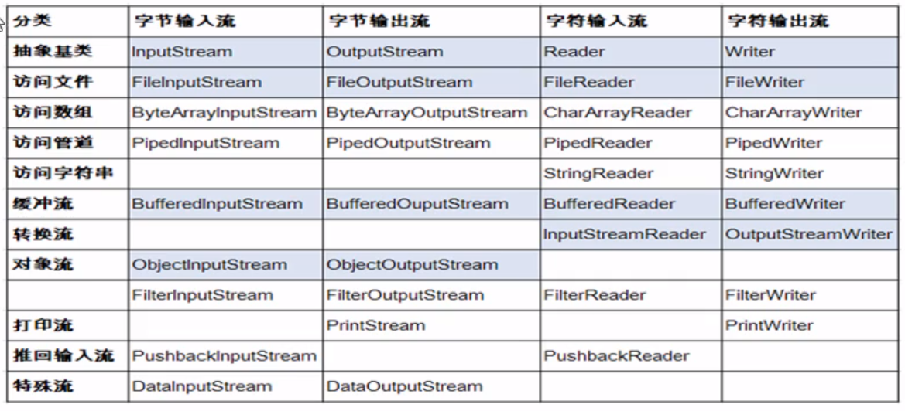
文件流
FileInputStream/FileOutputStream/FileReader/FileWriter
缓冲流
BufferedInputStream/BufferedOutputStream/BufferedReader/BufferedWriter
转换流
InputStreamReader/OutputStreamWriter
打印流（了解）
PrintStream/PrintWriter
数据流（了解）
DataInputStream/DataOutputStream
对象流
ObjectInputStream/ObjectOutputStream
随机存取文件流
RandomAccessFile

```java
/*文件流(基于硬盘，读写受到硬盘读写速度的制约)*/
/*字节输入流FileInputStream*/
FileInputStream in = new FileInputStream("src\\mycode\\myfile.txt");
byte[] b = new byte[100000000];
int len = 0;
//in.read(b)返回读取的长度，一次最多读取b.length个
while((len = in.read(b)) != -1){//循环读取，当读完时，再read就会返回-1
    System.out.println(new String(b,0,len));//此时len为数据长度
}
in.close();
/*字节输出流FileOutputStream*/
FileOutputStream out = new FileOutputStream("src\\mycode\\ttt.txt");
out.write("asdfasdgasd".getBytes());
out.flush();//把内存数据刷到硬盘
out.close();
/**
*字符输入流FileReader
*字符输出流FileWriter
*byte数组改为char数组，write时不需要.getBytes()
*其余同上
*/

/*缓冲流(基于内存，提高数据读写速度)*/
//BufferedInputStream用法与字节输入流FileInputStream相差不多
FileInputStream in = new FileInputStream("src\\mycode\\myfile.txt");
BufferedInputStream br = new BufferedInputStream(in);
byte[] b = new byte[10];
int len = 0;
while ((len = br.read(b)) != -1){
    System.out.println(new String(b,0,len));
}
br.close();//晚开的流先关
in.close();
/*BufferedOutputStream;BufferedReader;BufferedWriter略*/

/*转换流*/
//字节输入流转换为字符输入流
FileInputStream f = new FileInputStream("src\\mycode\\myfile.txt");
InputStreamReader in = new InputStreamReader(f,"UTF-8");
//字节输出流转换为字符输出流OutputStreamWriter略
//用例:控制台读取输入并保存到文本中
InputStreamReader in = new InputStreamReader(System.in);
BufferedReader br = new BufferedReader(in);
BufferedWriter out = new BufferedWriter(new FileWriter("ttt.txt"));
String line ="";
while (!(line=br.readLine()).equals("")){//输入回车时结束循环
    out.write(line);
}
out.flush();
out.close();
br.close();
in.close();

/*打印流和数据流略*/

/*对象流*/
//存储和读取对象的处理流ObjectInputStream/ObjectOutputStream
//可序列化的类必须实现接口Serializable或Externalizable

/*随机存取文件流*/
//RandomAccessFile，随机指程序可以直接跳到文件的任意位置来读写文件
RandomAccessFile ra = new RandomAccessFile("ttt.txt","rw");
ra.seek(ra.length());//设置写入文件内容的起始点
ra.write("xxxxxxx".getBytes());
ra.close();

```

## 反射Reflection
Reflection是被视为动态语言的关键，反射机制允许程序在执行期借助Relection API取得任何类的内部信息，并且直接操作任意对象的内部属性及方法

Java反射机制提供的功能：
在运行时判断任意一个对象所属的类
在运行时构造任意一个类的对象
在运行时判断任意一个类所具有的成员变量和方法
在运行时调用任意一个对象的成员变量和方法
**生成动态代理**

主要的API：
java.lang.Class代表类
java.lang.reflect.Method代表类的方法
java.lang.reflect.Field代表类的成员变量
java.lang.reflect.Constructor代表类的构造方法

#### Class类

Class对象只能由系统建立对象
一个类在JVM中只会有一个class实例
一个Class对象对应的是一个加载到JVM中的一个.class文件
每个类的实例都会记得自己是由哪个Class实例所生成
通过Class可以完整地得到一个类中的完整结构

Class类常用方法
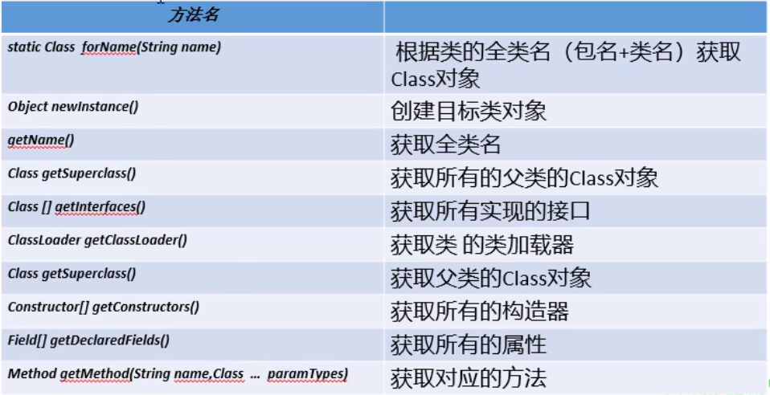

```java
/*实例化Class类对象的三种方法*/
Class c0 = Person.class;//通过类名.class创建指定类的class实例
Person p = new Person();
Class c1 = p.getClass();//通过类的实例.getClass()方法
Class c2 = Class.forName("mycode.Person");//通过Class的静态方法，常用
```

#### 通过反射获取类的完整结构

```java
Class c = Class.forName("mycode.Student");
Class superc = c.getSuperclass();//获取父类
Class[] interfaces = c.getInterfaces();//获取所有接口
Package pk = c.getPackage();//获取类所在的包

Constructor[] cons = c.getDeclaredConstructors();//获取类的所有的构造方法
Constructor[] cons1 = c.getConstructors();//获取类的公有的构造方法
/*Constuctor中：*/
String nameC = cons[0].getName();//获取名称
int modiC = cons[0].getModifiers();//获取修饰符，1表示public 2表示private
Class[] paramC = cons[0].getParameterTypes();//获取参数类型,返回Class数组

Method[] ms = c.getDeclaredMethods();//获取类的所有方法
Method[] ms1 = c.getMethods();//获取类的所有公有方法
/*Methond中：*/
String nameM = ms[0].getName();//获取方法名称
Class typeM = ms[0].getReturnType();//获取返回类型
int modiM = ms[0].getModifiers();//获取修饰符，1表示public 2表示private
Class[] paramM = ms[0].getParameterTypes();//获取参数类型

Field[] fie = c.getDeclaredFields();//获取类的所有的属性(不包括父类)
Field[] fie1 = c.getFields();//获取类的公有的属性(不包括父类)
/*Field中：*/
String nameF = fie[0].getName();//类比上面
Class typeF = fie[0].getType();
int modiF = fie[0].getModifiers();
```

#### 通过反射创建、调用类

```java
/*调用构造函数，创建对象*/
/*通过反射调用public构造器创建对象*/
Class c = Class.forName("mycode.Student");
Constructor cc = c.getConstructor();//调用了空参数的构造器
Student stu = (Student)cc.newInstance();
/*通过反射调用private构造器创建对象*/
Class c = Class.forName("mycode.Student");
Constructor cc = c.getDeclaredConstructor(String.class,int.class);//调用了两个参数的私有构造器
cc.setAccessible(true);//解除私有封装，下面可以对私有方法强制调用
Student stu = (Student)cc.newInstance("XX中学",123);

/*调用方法*/
Class c = Class.forName("mycode.Student");
Method m = c.getDeclaredMethod("test",String.class);//getMethod(方法名，方法参数)
m.setAccessible(true);//调用private方法时需要
int i = (int) m.invoke(stu,"...args");//m.invoke(对象，方法参数)，方法返回值为int

/*调用属性*/
Class c = Class.forName("mycode.Student");
Field f = c.getDeclaredField("school");//(属性名)
m.setAccessible(true);//调用private方法时需要
String s = (String) f.get(stu);//f.get(对象)，取得指定对象上的属性内容
f.set(stu,"222");//f.set(对象，属性内容)，设置指定对象的属性内容
```

#### Java动态代理

Proxy：专门完成代理的操作类，是所有动态代理的父类。通过此类为一个或多个接口动态地生成实现类

```java
/*简单应用举例*/
import java.lang.reflect.InvocationHandler;
import java.lang.reflect.Method;
import java.lang.reflect.Proxy;

public class test {
    public static void main(String[] args) throws Exception {
        Move stu = new Student();//想要被代理，需要有对应的接口
        InvocationHandler handler = new ProxyDemo(stu);
        /**
         * Proxy.newProxyInstance(ClassLoader,interfaces,h)
         * ClassLoader代理对象的类加载器
         * interfaces被代理对象的接口
         * h代理对象
         * 返回值赋予被代理的接口
         * */
        Move m = (Move) Proxy.newProxyInstance(handler.getClass().getClassLoader(),stu.getClass().getInterfaces(),handler);
        m.moveType();
    }
}

interface Move{
    void moveType();
}

class Student implements Move{
    @Override
    public void moveType() {
        System.out.println("走路上学");
    }
}

class ProxyDemo implements InvocationHandler {
    Object obj;//被代理的对象
    public ProxyDemo(Object obj){this.obj=obj;}
    @Override
    public Object invoke(Object o, Method method, Object[] objects) throws Throwable {
        System.out.println(method.getName()+"开始执行");
        Object res = method.invoke(this.obj,objects);
        System.out.println(method.getName()+"执行完毕");
        return res;
    }
}
```

## 线程

程序program，完成特定任务、用某种语言编写的一组指令的结合。即指一段静态的代码，静态对象。
进程process，程序的一次执行过程，或者是正常运行的程序，它有自身的产生、存在和消亡的过程。
线程thread，进程可进一步细化为线程，是一个程序内部的一条执行路径。多线程实现java.lang.Tread，具有异步性

#### 创建线程

```java
/*
*定义子类继承Thread类
*子类中重写Thread类中的run方法
*创建Thread子类对象，即创建了线程对象
*调用线程对象start方法：开启线程，调用Thread子类的run方法
*/
 class TestThread extends Thread{
     @Override
     public void run() {
         System.out.println("多线程运行的代码");
         for(int i=10;i>=0;i--)
             System.out.println(i);
         super.run();
     }
 }
//main函数中
Thread t = new TestThread();//多态
t.start();//启动线程
Thread t1 = new TestThread();
t1.start();

/*
*定义子类实现Runnable接口（常用）
*子类中重写Runnable接口中的run方法
*通过Thread类含参构造器创建线程对象
*将Runnable接口的子类对象作为实际参数传递给Thread类的构造方法
*调用Thread类的start方法：开启线程，调用Runnable子类接口的run方法
*/
 class TestRunnable implements Runnable{
     @Override
     public void run() {
         System.out.println("多线程运行的代码");
     }
 }
//main函数中
Thread t = new Thread(new TestRunnable(),"线程名称");//线程名称是可选参数
t.start();
```

#### Thread类
void start() 启动线程，执行对象的run方法
run() 线程在被调度时执行的操作
String getName() 返回线程名称
void setName() 设置线程名称
static currentThread() 返回当前线程
int getPriority();获取线程优先级；1至10表示优先级,默认优先级5
void setPriority();设置优先级
static void yield() 线程让步，暂停正在执行的线程，给优先级相同或更高的线程
void join() 阻塞当前线程，直到.join线程执行完毕
static void sleep(long millis) 线程睡眠，单位是毫秒数 
stop() 强制结束线程
Boolean isAlive() 判断线程是否存活

#### 线程的生命周期

线程的一个完整的生命周期通常要经历五种状态
新建：当一个Thread类或其子类对象被声明并创建时，新生的线程对象处于新建状态
就绪：处于新建状态的线程被start()后，将进入线程队列等待CPU时间片，此时它已具备了运行条件
运行：当就绪的线程被调度并获得处理器资源时，便进入运行状态，run()方法定义了线程的操作和功能
阻塞：在某种特殊情况下，被人为挂起或执行输入输出操作时，让出CPU并临时中止自己的执行，进入阻塞状态（？）
死亡：线程完成了它的全部工作或线程被提前强制性地中止

#### 线程的同步

多个线程执行的不确定性引起执行结果的不稳定，多个线程对账本的共享，会造成操作的不完整性，破坏数据。
死锁：类比数据库死锁，略

```java
/*synchronized（同步锁）的简单实例*/
//假设有两个用户要对同一个账户进行取款
 class Account {
    public int money = 3000;
    public void drawing(int m){
        String name = Thread.currentThread().getName();
        if(money < m){
            System.out.println(name + "操作，余额不足");
            return;
        }
        System.out.println(name + "操作，原有金额" + money);
        System.out.println(name + "操作，取款金额" + m);
        money -= m;
        System.out.println(name + "操作，现有金额" + money);

    }
 }
 class User implements Runnable{
    Account acount;
    int money;
    public User(Account account,int money){
        this.acount = account;
        this.moeny = money;
    }
     @Override
     public void run() {
        acount.drawing(money);
     }
 }
//main中
Account a = new Account();
User u0 = new User(a,2000);
User u1 = new User(a,2000);
Thread t0 = new Thread(u0,"线程0");
Thread t1 = new Thread(u1,"线程1");
t0.start();
t1.start();
 /**
  * 会出现金额为负数的问题
  * 解决方法：指定对象加锁
  * 1.public synchronized void drawing(int m)
  * 2.synchronized(this){drawing的代码块}
  * */

/*线程通信*/
//wait()
//notify()
//notifyAll()
```

